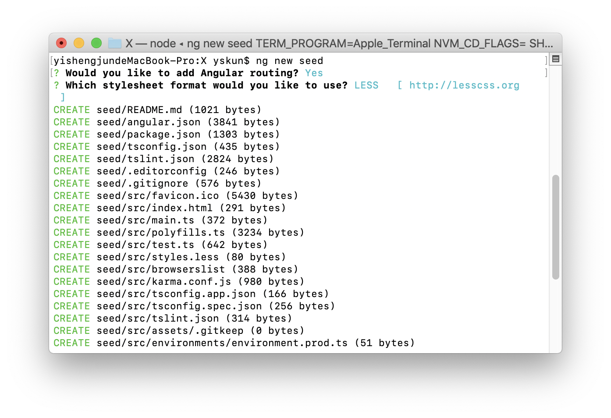

# 使用Angular cli升级AngularJS项目——（一）引导运行混合应用  
## 前言  
都9102年了，笔者所在的公司的主要项目还是用AngularJS 1.6这种史诗的框架进行开发的。另外由于历史的原因，代码的凌乱程度早已超越想象。为此，笔者决定痛下决心把整个项目重构了一遍...从此踏上了Angular升（跳）级（坑）之路。  

先说说升级前后的变化：  
项目管理：gulp -> gulp + Angular CLI  
框架：AngularJS 1.6 -> AngularJS 1.6 + Angular 7  
应用结构：多个AngularJS应用 -> 主项目：Angular、卫星项目：AngularJS  

### 在这个系列文章中涉及到
1. Angular与AngularJS如何共存开发
2. 使用Angular Cli编译及开发Angular、AngularJS混合应用  
---下面是坑，待填
3. 如何在Hash模式中同步AngularJS、Angular的路由
4. 在gulp或其他自动化构建工具中使用Angular CLI
5. 在Angular中使用AngularJS的组件
6. 在AngularJS中使用Angular的组件

### 本文使用的例子项目
AngularJS的例子项目[angular-phonecat](https://github.com/angular/angular-phonecat)

## 为什么升级为Angular框架  
在笔者公司内部，大部分新项目已经开始使用Vue进行开发。笔者也更加倾向于Vue简单、优雅的开发形式，较为符合前端（浪荡）的开发模式。同时对于新手而言Vue更加容易上手。但对于笔者手上的项目而言，升级为Angular是为数不多可行的方案：  
1. 渐近式升级  
由于项目年代久远，项目涉及到了公司各个业务的方方面面。难以在短时间内完成全部的重构工作。在重构的同时，也需要兼顾到新业务的开发。（曾经这个项目在多个大佬的带领下重构过，但无一幸免的全部夭折）。为此，选择升级为Angular的第一考量的对象就是是否可以“在原有的基础上进行重构”，而Angular官方提供的``@angular/upgrade``则很好的解决了这个问题。直至完全重构为止，旧的代码仍能直接运行在项目中，不受重构的影响。
2. 更加严谨的开发
在改造前的项目中包含了几个5000+行的文件，每次添加都非常“蛋疼”，出现这种问题的主要原因就是在这几年间，都没有对项目提交代码进行规范，同时也没有进行Code Review等操作。使用TypeScript可以让一部分Freshman放弃他们浪荡的代码风格。此外，对于太过烂的代码，**Angular甚至不能让其编译通过**。这种框架以及语言特性决定了Angular更加擅长于开发更加严谨的项目。  
当然，Vue也能使用TypeScript，经过规范的Vue编码风格也能使其变得更严谨，前提是你得忍受编辑器对vue中的ts语言的支持：）  

## 一、前期准备
### 检查你的项目是否包含Angular cli无法支持的编译特性。  
在笔者公司项目中，使用gulp作为项目管理工具。其中包含了``gulp-file-include``在html文件中引入其他html片段的插件，但是如果使用Angular cli(以下简述为：ng cli)作为项目编译开发工具，这些过程是不能被支持的。因此，应当先将它们去除。  
### 安装Angular CLI
笔者使用的是yarn：
```
  yarn global add @angular/cli
```
如果你是使用npm：
```
  npm i @angular/cli -g
```

## 二、新建一个种子项目
Angular的迭代更新速度是有目共睹的，笔者建议直接新建一个种子项目，而非直接复制本文提及的依赖关系。

 
具体的使用方法见[官方文档](https://cli.angular.io/)  
运行完毕后，将以下文件复制到你的项目中：  
* package.json  
  若项目中已存在package.json你可以直接复制与angular有关的依赖。
  ``` JSON
  "dependencies": {
    "@angular/animations": "~7.1.0",
    "@angular/common": "~7.1.0",
    "@angular/compiler": "~7.1.0",
    "@angular/core": "~7.1.0",
    "@angular/forms": "~7.1.0",
    "@angular/platform-browser": "~7.1.0",
    "@angular/platform-browser-dynamic": "~7.1.0",
    "@angular/router": "~7.1.0",
    "core-js": "^2.5.4",
    "rxjs": "~6.3.3",
    "tslib": "^1.9.0",
    "zone.js": "~0.8.26"
  },
  "devDependencies": {
    "@angular-devkit/build-angular": "~0.11.0",
    "@angular/cli": "~7.1.2",
    "@angular/compiler-cli": "~7.1.0",
    "@angular/language-service": "~7.1.0",
    "typescript": "~3.1.6"
  }
  ```
* tsconfig.json。typescript配置文件
* angular.json。angular配置文件
* src 目录。angular源码文件夹，你可以将其放到你的项目中适当的地方。

## 三、添加升级依赖
在种子项目中,是不包含AngularJS升级模块的，你需要手动添加该模块。
```
yarn add @angular/upgrade
```

## 四、将AngularJS的js、style交给angular cli管理

  
AngularJS的引入方式一般有两种形式
1. 使用了模块化的
   如果本身已经使用了模块化的编程，那么你要做的就是移除原本的模块引导器(如SystemJs等)、在index.html中移除ng-app。并在main.ts中import AngularJS入口文件即可。   
   **注意：你或许还需在``tsconfig.json``中加入：**  
   ``` JSON
    "compilerOptions": {
      ...
      "allowJs": true,
      ...
    }
   ```

2. 一般引入形式的
   如果项目中使用的是传统引入形式，你需要将他们全部删除掉，并在angular.json中``projects -> porjectName -> architect -> build``中的``styles``、``scripts``属性添加相应的样式、js文件。在此添加的文件，angular cli会在编译、开发过程中，进行合并压缩操作。然后在index.html中将``ng-app``移除。


### 添加assets文件夹
在AngularJS中，存在一些如`templateURL`等，需要从服务器加载的内容。因此，我们需要在angular.json中映射源代码文件夹，使它能在``serve``的过程中，能被访问到。  
具体路径：angular.json ``projects -> porjectName -> architect -> build -> assets``

## 五、在index.html中添加angular的入口
``<app-root></app-root>``是angular的入口标记，你可以将其添加至index.html中合适的位置，一般为了结构一致，会放在与AngularJS相邻的地方。

  

## 六、引导AngularJS模块
到这里，你已经可以使用``ng serve``进行开发了。但实际上，如果此时开始运行的话，在页面中只会有Angular模块的内容，没有AngularJS模块的内容。

  
实际上，js的脚本已经通过ng cli进行处理，并合并为scripts.js，但由于在此前的操作中，我们将AngularJS的ng-app指令移除了。为此我们需要在angular加载过程中手动加载AngularJS模块。  

app.module.ts  
``` JavaScript
import { BrowserModule } from '@angular/platform-browser';
import { NgModule, DoBootstrap, ApplicationRef } from '@angular/core';
import { AppRoutingModule } from './app-routing.module';
import { AppComponent } from './app.component';
import { UpgradeModule } from '@angular/upgrade/static';

@NgModule({
  declarations: [
    AppComponent
  ],
  entryComponents: [AppComponent],
  imports: [
    BrowserModule,
    AppRoutingModule,
    UpgradeModule
  ],
  providers: [],
})
export class AppModule implements DoBootstrap {
  constructor(private upgrade: UpgradeModule){}

  // 手动接管加载进程
  ngDoBootstrap(appRef: ApplicationRef) {
    this.upgrade.bootstrap(document.documentElement, ['phonecatApp']); // 引导AngularJS模块
    appRef.bootstrap(AppComponent) // 引导Angular模块
  }
 }

```
## 七、大功告成
现在运行``ng serve``就可以看到同时运行Angular、AngularJS的页面了！


（未完待续）

## 源码
由于篇幅有限，实际上还有几处修改未在文段中展示。在此，你可以获取到本文修改后的angular-phonecat项目。
[https://github.com/yskun/angular-phonecat-upgrade]

## 参考
1. [从 AngularJS 升级到 Angular
](https://angular.cn/guide/upgrade)  
2. [升级 AngularJS 至 Angular](https://www.cnblogs.com/sghy/p/9150346.html)