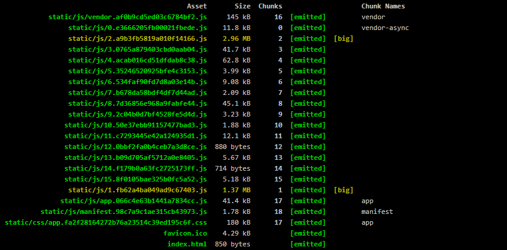

# Vue项目减肥之旅



P.S. 本文同时适用于：使用webpack打包的项目。

俗话说得好，引用依赖一时爽，一直引用一直爽。  
直到刹那间嫣然回首，咱们熟悉的<del>瘦高个</del>“老朋友”（项目君）早早的已经变成了一个臃肿大胖子。究竟是谁让它变得如此的臃肿？<del>是人性的扭曲还是道德的沦丧？</del>  
<del>敬请收看走近科学！</del>

在开发项目的过程中，我们往往需要引用到大量的第三方模块(node modules)。确实，通过引用第三方模块，能大大的简化开发的过程，提高工程质量。但难免的，也带来了“体积”这个问题。笔者曾经开发过一个简单的网站项目，功能简单，业务逻辑也只是纯粹的查看信息。但在经过了混淆压缩后，依然达到了1M多。是的，这个项目毫无疑问是不及格的。因为即便在现今随随便便百兆网络的时代下，由于服务器、通路等多重因素的影响下，整个项目的加载往往需要数秒钟。在网络上有人是这么描述这几秒钟的：

> 如果网页加载时间超过4秒，约有四分之一的人会放弃打开该网页。   
> 如果网页加载时间超过10秒，50%的移动用户会放弃该网页，约五分之三的人不会再返回该网站。

所以，我们在可允许的范围内，除了在物理层面上增强我们的访问速度外，还应该从项目的根源入手，尽可能的减少访问需要的时间。  
在本文中，笔者总结了之前项目中一些精简项目的方法，希望能对各位看官有所帮助。

## 一、分析你的项目
一般情况下，webpack是vue项目的不二之选。那么，如何分析使用webpack打包后的包文件呢？在这里就要介绍本文的核心主角包分析工具——```webpack-bundle-analyzer```。


众所周知的，webpack是一个将网页元素打包的工具。在一个JS文件中，不仅包含了javascript的代码，还包含了如“html”、“css”等等元素。如果纯粹的通过直接分析包中的内容，或者通过分析webpack配置（甚至在Vue Cli 3、Angular Cli 3，根本就不存在webpack配置文件），是非常不现实的事情。而```webpack-bundle-analyzer```则可以为我们提供图形化的包分析。
  
在webpack-bundle-analyzer中，我们可以看到各个模块所占项目的比例，以及模块在```Stat```、```Parsed```、```Gzipped```状态下的大小。嗯，是的，这样我们就能找出使项目臃肿的元凶了！

## 二、引入\开启项目的分析功能
* 使用Vue Cli 3的项目  
对于使用Vue cli 3管理的项目而言，它已经内置了包分析的功能。只需要在编译时，加入参数```--report```即可生成分析报告。
* 使用Vue Cli 2或其他Webpack项目
首先，你需要安装```webpack-bundle-analyzer```
```
# NPM 
npm install --save-dev webpack-bundle-analyzer
# Yarn 
yarn add -D webpack-bundle-analyzer
```
然后，添加到项目的配置文件中：
``` JavaScript
const BundleAnalyzerPlugin = require('webpack-bundle-analyzer').BundleAnalyzerPlugin;
 
module.exports = {
  plugins: [
    new BundleAnalyzerPlugin()
  ]
}
```
编译完毕后，即会生成分析报告。

* 题外话：Angular 项目  
与Vue Cli 3类似的，在ng cli中同样包含了包分析的功能。在编译时，加入参数```--stats-json```将会生成一个json文件。  
你可以通过 ````webpack-bundle-analyzer``` 或者 https://webpack.github.io/analyse 分析包结构

## 三、精简依赖
既然我们现在已经知道了“元凶”是谁了，那我们现在应该去处理它了。对于，不同的第三方模块我们有不同的方法去解决它：

### 1. 常规方法：按需引入（最小化引入）
一般最常用的import形式是这样的：
``` JavaScript
import crypto from 'crypto-js'
...
crypto.HmacSHA1()
...
```
这种方法将会引入整个crypto（第三方模块）。然而，我们往往仅需要其中的一两个方法。这是一个非常不划算的行为，同时也是项目中最常见的臃肿的原因。通过局部引入需要的方法，我们便可以很大程度的减少项目的臃肿程度：
``` JavaScript
import HmacSHA1 from 'crypto-js/hmac-sha1'
...
crypto.HmacSHA1()
...
```
至于如何找到局部引入的文件，因为不同模块的项目结构不尽一致，所以没有一个标准的答案。不过，最常见的方法，就是查看第三方模块的入口文件或者查阅官方的文档，往往可以找到最小化引入的方法。

### 2. 折中的方法：异步加载
影响首屏加载速度的，是那些随着html文件“同步”下载的js文件。有不少第三方模块是不会在首屏加载时用到的，而且他们无法通过“最小化引入”有效减少它们的大小。此时，便应该考虑将一些无需随着首屏加载的内容，通过异步的形式，在它们需要的时候加载。  
熟悉Vue的各位大佬们大概都早已熟知Vue异步组件的写法
``` JavaScript
...
components: {
    asyncComponent: () => import('./asyncComponent.vue')
    // function(){
    //   return import('./asyncComponent.vue')
    // }
}
...
```
对于新手而言，他们可能会误认为这是Vue中提供的异步组件加载的方式。但实际上，这是webpack进行异步模块加载的方法。import可以运用在各个方面，如：加载Echarts  
``` JavaScript
const Echarts = () => import('echarts')
...
 Echarts().then(echarts => {
     echarts.xxx()
 })
...
```

### 3. 一些UI库的按需引入
很多流行的UI库是无法直接按需引入需要的组件的（其实很多都是可以的，但小部分组件会出现问题）。如：Element、ant-design-vue、iView 、Mint UI等等。但他们往往非常的“庞大”，多数可达2~3M。对于网页应用而言，这肯定是无法接受的。不过万幸的是，它们的官方文档中，都注明了可以通过```babel-plugin-component```进行按需引入。具体的方法可以参阅它们各自的官方文档。需要注意的是，由于css文件还是完整引入的，需要注意样式被污染的问题。


## 来源
[网页加载超过4秒，25%的人会放弃；手机网页超过10秒，50%用户会放弃](https://www.douban.com/group/topic/29709485/)