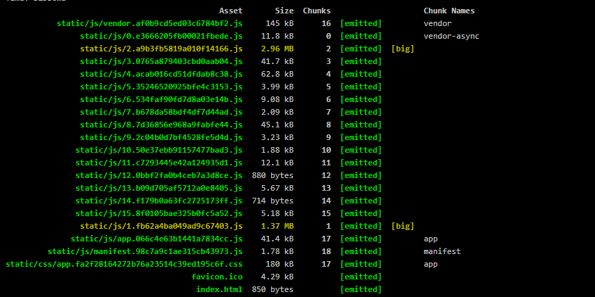
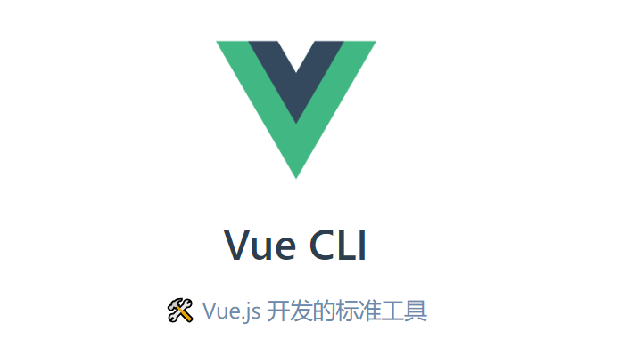
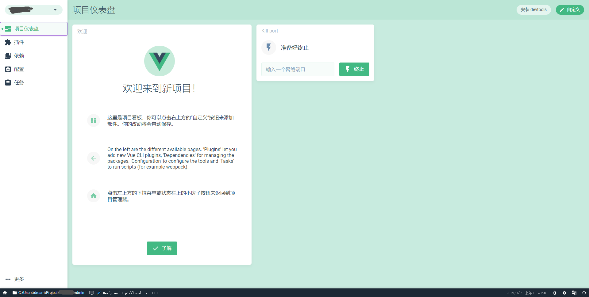

# Vue项目减肥之旅（前端项目体积精简的几种方法）



P.S. 本文同时适用于：使用webpack打包的项目。

俗话说得好，引用依赖一时爽，一直引用一直爽。  
直到刹那间嫣然回首，咱们熟悉的<del>瘦高个</del>“老朋友”（项目君）早早的已经变成了一个臃肿大胖子。究竟是谁让它变得如此的臃肿？<del>是人性的扭曲还是道德的沦丧？</del>  
<del>敬请收看走近科学！</del>

在开发项目的过程中，我们往往需要引用到大量的第三方模块(node modules)。确实，通过引用第三方模块，能大大的简化开发的过程，提高工程质量。但难免的，也带来了“体积”这个问题。笔者曾经开发过一个简单的网站项目，功能简单，业务逻辑也只是纯粹的查看信息。但在经过了混淆压缩后，依然达到了1M多。是的，这个项目毫无疑问是不及格的。因为即便在现今随随便便百兆网络的时代下，由于服务器、通路等多重因素的影响下，整个项目的加载往往需要数秒钟。在网络上有人是这么描述这几秒钟的：

> 如果网页加载时间超过4秒，约有四分之一的人会放弃打开该网页。   
> 如果网页加载时间超过10秒，50%的移动用户会放弃该网页，约五分之三的人不会再返回该网站。

所以，我们在可允许的范围内，除了在物理层面上增强我们的访问速度外，还应该从项目的根源入手，尽可能的减少访问需要的时间。  
在本文中，笔者总结了之前项目中一些精简项目的方法，希望能对各位看官有所帮助。

## 一、分析你的项目
一般情况下，webpack是vue项目的不二之选。那么，如何分析使用webpack打包后的包文件呢？在这里就要介绍本文的核心主角包分析工具——```webpack-bundle-analyzer```。


众所周知的，webpack是一个将网页元素打包的工具。在一个JS文件中，不仅包含了javascript的代码，还包含了如“html”、“css”等等元素。如果纯粹的通过直接分析包中的内容，或者通过分析webpack配置（甚至在Vue Cli 3、Angular Cli 3，根本就不存在webpack配置文件），是非常不现实的事情。而```webpack-bundle-analyzer```则可以为我们提供图形化的包分析。
  
在webpack-bundle-analyzer中，我们可以看到各个模块所占项目的比例，以及模块在```Stat```、```Parsed```、```Gzipped```状态下的大小。嗯，是的，这样我们就能找出使项目臃肿的元凶了！

## 二、引入\开启项目的分析功能
* 使用Vue Cli 3的项目  
对于使用Vue cli 3管理的项目而言，它已经内置了包分析的功能。只需要在编译时，加入参数```--report```即可生成分析报告。
* 使用Vue Cli 2或其他Webpack项目
首先，你需要安装```webpack-bundle-analyzer```
```
# NPM 
npm install --save-dev webpack-bundle-analyzer
# Yarn 
yarn add -D webpack-bundle-analyzer
```
然后，添加到项目的配置文件中：
``` JavaScript
const BundleAnalyzerPlugin = require('webpack-bundle-analyzer').BundleAnalyzerPlugin;
 
module.exports = {
  plugins: [
    new BundleAnalyzerPlugin()
  ]
}
```
编译完毕后，即会生成分析报告。

* 题外话：Angular 项目  
与Vue Cli 3类似的，在ng cli中同样包含了包分析的功能。在编译时，加入参数```--stats-json```将会生成一个json文件。  
你可以通过 ````webpack-bundle-analyzer``` 或者 https://webpack.github.io/analyse 分析包结构

## 三、精简依赖
既然我们现在已经知道了“元凶”是谁了，那我们现在应该去处理它了。对于，不同的第三方模块我们有不同的方法去解决它：

### 1. 常规方法：按需引入（最小化引入）
一般最常用的import形式是这样的：
``` JavaScript
import crypto from 'crypto-js'
...
crypto.HmacSHA1()
...
```
这种方法将会引入整个crypto（第三方模块）。然而，我们往往仅需要其中的一两个方法。这是一个非常不划算的行为，同时也是项目中最常见的臃肿的原因。通过局部引入需要的方法，我们便可以很大程度的减少项目的臃肿程度：
``` JavaScript
import HmacSHA1 from 'crypto-js/hmac-sha1'
...
crypto.HmacSHA1()
...
```
至于如何找到局部引入的文件，因为不同模块的项目结构不尽一致，所以没有一个标准的答案。不过，最常见的方法，就是查看第三方模块的入口文件或者查阅官方的文档，往往可以找到最小化引入的方法。

### 2. 折中的方法：异步加载
影响首屏加载速度的，是那些随着html文件“同步”下载的js文件。有不少第三方模块是不会在首屏加载时用到的，而且他们无法通过“最小化引入”有效减少它们的大小。此时，便应该考虑将一些无需随着首屏加载的内容，通过异步的形式，在它们需要的时候加载。  
熟悉Vue的各位大佬们大概都早已熟知Vue异步组件的写法
``` JavaScript
...
components: {
    asyncComponent: () => import('./asyncComponent.vue')
    // function(){
    //   return import('./asyncComponent.vue')
    // }
}
...
```
但对于新手而言，他们可能会误认为这是Vue中提供的异步组件加载的方式。但实际上，这是webpack进行异步模块加载的方法。import可以运用在各个方面，如：加载Echarts  
``` JavaScript
const Echarts = () => import('echarts')
...
 Echarts().then(echarts => {
     echarts.xxx()
 })
...
```
***此方法也可以在Angular 8中使用***

### 3. 一些UI库的按需引入
很多流行的UI库是无法直接按需引入需要的组件的（其实很多都是可以的，但小部分组件会出现问题）。如：Element、ant-design-vue、iView 、Mint UI等等。但他们往往非常的“庞大”，多数可达2~3M。对于网页应用而言，这肯定是无法接受的。不过万幸的是，它们都可以通过```babel-plugin-component```进行按需引入（或者直接按需引入）。具体的方法可以参阅它们各自的官方文档。需要注意的是，由于css文件是全局引入的，需要注意样式被污染的问题。

### 4. 一些特殊的模块的精简方案
对于一些特殊的模块而言，他们可能无法使用“按需引入”的方法进行瘦身。就比如“moment.js”，在引入其本体的同时，它会附带全部的多语言支持的模块。但这些往往是我们不需要的。
#### webpack ContextReplacementPlugin
ContextReplacementPlugin 可以通过正则表达式或其他过滤条件忽略引入的第三方模块的某些文件，从而达到瘦身的需求。

在webpack的[官方文档](https://www.webpackjs.com/plugins/context-replacement-plugin/)中，正是以moment.js作为实例的。

```JavaScript
new webpack.ContextReplacementPlugin(
  /moment[\/\\]locale$/,
  /de|fr|hu/
)
```

#### 既然这是一个大胖子。为什么不去换一个瘦高个呢？
在所有的方法都无法满足功能需求>文件体积的时候，为何不尝试换一个模块试试呢？  
在npm中充斥着大量的功能相似的moudule，比如：querystring，我所知的就有qs\query-string\querystringify...它们大多功能相似，但由于实现的方法、考量的形式不同等等方面，导致了它们之间存在不少的差异。因此，为了减少不必要的文件体积，我们可以尝试选择与之相似的或者功能没有如此强大的但恰好符合我们需求的模块。就如“moment.js”在多数的情况下，可以被“dayjs”所替代。而后者则宣称它只占用2kb的空间。

***当然，在选择第三方模块的时候，也需要考量这个模块是否足够的成熟。***

### 5. 终极方案：自己实现吧
第三方模块能帮助我们解决很多问题。但并不是所有的“复杂”功能都需要通过引入第三方模块来解决。  
举个简单的栗子：  
如果你只需要获取URL中的参数，你不需要引入Vue Router或者XXX Router。你只需要qs.parse(location.search)即可.甚至连qs库都无需引入：
```JavaScript
Object.fromEntries(
  location.search
    .slice(1)
    .split('&')
    .map(v => v.split('='))
)
```
