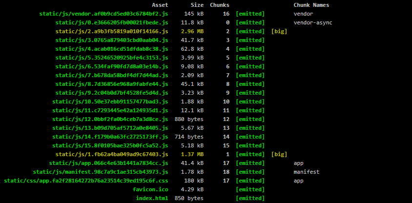
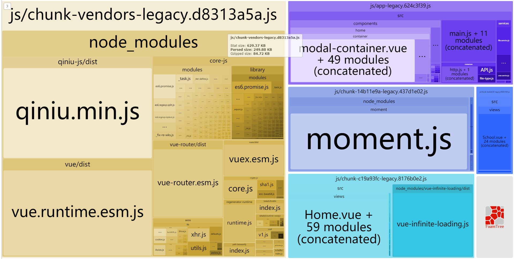
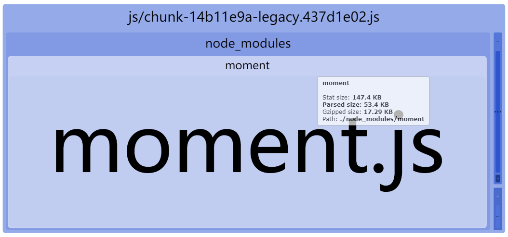

# 优化你的VUE项目 -- 精简Vue项目

在很多的情况下，我们需要引用很多的依赖去实现我们的业务流程。  
俗话说，依赖一时爽，上线那个啥。刨除掉某些坑爹的第三方框架不谈，单是编译后文件大小就已经足够折腾一会了。

毕竟，咱们老板老生常谈的话题就是：用户体验优先啊！你这个网页，一秒钟打不开有多少用户就跑了。

所以，为了用（tao）户（hao）体（lao）验（ban），笔者只能逐个检查项目，优化项目去了...

## 一、掏出利器 Vue Cli 3
在编译过程中，我们会看到编译器中反映的每个文件的大小。
  
嗯，我们都知道2.\*\*.js和1.\*\*.js这个文件很大很大了，在一般的网络环境中，3M多的大小往往需要数十秒乃至几分钟的等待时间，对于用户而言，这确实是非常糟糕的体验。那么，这些文件中究竟包含了什么东西导致了它竟然“高达”3M呢？<del>来让我们用vs code打开它们究竟都有些啥！</del>  
这个时候，我们需要请出Vue Cli 3了。  
  
Vue Cli也算是我们的老盆友了，通常Vue的开发都是基于它进行的。在Vue cli 3中，不仅优化了开发、编译的体验，还额外添加了图形化界面。  
首先，运行```vue ui``` -> 导入相应的项目。然后，进入项目的仪表盘  

接下来就可以对项目进行分析了。


## 二、精简依赖
通过Vue Cli我们就可以知道，是“谁”让你的项目变得如此得大了。那剩下的，就应该帮它们瘦瘦身了。  
### 通用大法：按需引入、异步加载
在平时，我们通常会使用以下方法import整个第三方依赖。  
``` JavaScript
import crypto from 'crypto-js'
...
crypto.HmacSHA1()
...
```
通过这个方法引入将会包含整个库文件，但往往或许我们需要的仅仅是HmacSHA1这一个方法。然后，我们不得不将整个库打包。而项目则在不知不觉中长成了一个大胖子。为了避免这种状况，在引入依赖的时候，我们应该考虑尽可能减少引入的“规模”。  
以crypto.HmacSHA1为例：
``` JavaScript
import HmacSHA1 from 'crypto-js/hmac-sha1'
...
crypto.HmacSHA1()
...
```
上述的写法只包含了HmacSHA1的相关依赖，大大减少了依赖的size。这种写法适用于很多常用的库，如crypto-js、lodash、underscore、Rxjs等等都可以通过这方法引入，减少不必要的size。

对于一般的库而言，通过上面的操作确实能减少库的size，但在某些特殊的库中，我们不能选择按需加载的形式，减少文件size。如：Echarts(实际上是可以的，详见下文)、一些样式库等等，而且这些库仅仅是在某些页面需要被使用。针对这种情况，就可以考虑异步加载这种形式了。如果，你曾经使用过异步组件的加载，那么相信你已经很熟悉这种方法了。
``` JavaScript
const Echarts = () => import('echarts')
...
 Echarts().then(echarts => {
     echarts.xxx()
 })
...
```

### UI库按需引入
UI库往往是一个很“重”的库，全部引入的话，大概需要2~3MB的大小。如果是面向后台系统，这种面向工作人员的项目自然是没有问题。但如果项目是面向公众的，这么大的size自然是不妥当的。  
在国内的一些流行的UI库中，如Element、ant-design-vue、iView 、Mint UI，他们都可以借助[babel-plugin-component](https://github.com/ElementUI/babel-plugin-component)进行按需引入。具体的使用方法见各个库的文档。  
但需要注意一点的是：很多时候，直接使用和其他组件一致的按需引入的方法，也是可以引入的，但是可能会出现潜在的问题（比如：笔者之前引入的radio组件就会莫名崩溃）。

### 精简 MomentJs
笔者曾经以为MomentJs是一个很小的库，在项目中，只是作为转换日期格式使用。但是，它竟然接近500kb的身形，不禁让我折服。至于为何它会如此的“巨大”呢？其原因就在于，MomentJs拥有很多语言资源文件。它可以帮你转换成多国时间格式。但我们往往不需要如此强大的功能，但MomentJs是无法进行按需加载的。所以我们需要借助webpack插件的力量，让它瘦身。  
在vue.config.js文件中添加IgnorePlugin：
``` JavaScript
const webpack = require('webpack')

module.exports = {
  configureWebpack: {
    plugins: [
      new webpack.IgnorePlugin(/^\.\/locale$/, /moment$/)
    ]
  }
}
```
如果需要引入某些语言包，在项目中引入即可。
``` JavaScript
const moment = require('moment');
require('moment/locale/ja');
 
moment.locale('ja');
```

### 精简Echarts
